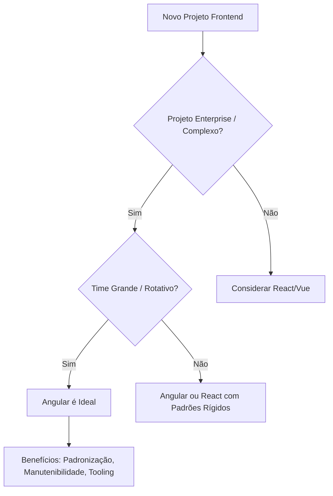

# Angular: Robustez e Padronização

O **Angular**, mantido pelo Google, não é apenas uma biblioteca, é uma plataforma. Ele oferece uma solução "baterias inclusas" para o desenvolvimento web, onde todas as ferramentas necessárias (roteamento, formulários, requisições HTTP) já vêm integradas e configuradas.

## 📊 Infográfico de Decisão

## 🏆 Principais Vantagens

1.  **Opinião Forte**: Existe um "jeito Angular" de fazer as coisas. Isso elimina discussões triviais sobre quais bibliotecas usar.
2.  **TypeScript Rigoroso**: Foi o pioneiro em adotar TypeScript, garantindo tipagem forte e refatoração segura desde o dia zero.
3.  **Ferramentas Integradas**: Forms reativos poderosos, Cliente HTTP com interceptors, Router robusto e sistema de injeção de dependência.
4.  **RxJS**: Integração nativa com programação reativa para lidar com fluxos de dados complexos assíncronos.

## ⚠️ Desvantagens

*   **Curva de Aprendizado**: É alta. É preciso aprender sobre Módulos, Componentes, Diretivas, Pipes, Services, RxJS, etc.
*   **Verbosidade**: Exige mais código (boilerplate) para fazer coisas simples comparado ao React ou Vue.
*   **Bundle Size**: Aplicações Angular tendem a ser mais pesadas inicialmente (embora o Ivy compiler e Standalone Components tenham melhorado isso).

## 🚀 Escalabilidade e Performance

O Angular brilha na **escalabilidade de manutenção**.
*   Em projetos com centenas de telas e dezenas de desenvolvedores, a estrutura rígida do Angular impede que o projeto vire um caos.
*   O recurso de **Lazy Loading** de módulos é nativo e fácil de implementar, garantindo que o usuário baixe apenas o necessário.
*   **Signals**: A nova feature de reatividade granular promete performance de renderização comparável ou superior a frameworks mais leves.

## 🛡️ Segurança

O Angular é muito seguro por padrão.
*   **Sanitização Automática**: O framework trata todos os valores como não confiáveis, prevenindo ataques XSS (Cross-Site Scripting) automaticamente ao fazer o bind de dados no HTML.
*   **Proteção CSRF**: O módulo HTTP possui suporte integrado para proteção contra Cross-Site Request Forgery.

## ⚡ Produtividade

*   **Curto Prazo**: Baixa. A configuração inicial e o aprendizado dos conceitos levam tempo.
*   **Longo Prazo**: Altíssima. A CLI do Angular (`ng generate`) automatiza a criação de arquivos, testes e refatorações. A consistência do código permite que desenvolvedores mudem de time e sejam produtivos no primeiro dia.

## 🎯 Quando Usar?

*   **Aplicações Enterprise (ERP, CRM)**: Sistemas complexos com muitos formulários e regras de negócio no frontend.
*   **Grandes Equipes**: Onde a padronização é vital para evitar dívida técnica.
*   **Aplicações de Longa Vida**: Projetos que precisam de manutenção por 5+ anos. O Google garante suporte de longo prazo.
*   **Interfaces Desktop-like**: Aplicações ricas que imitam software desktop na web.

## 🏗️ Sustentação

O time do Angular leva a estabilidade a sério. Eles fornecem ferramentas de migração automática (`ng update`) que facilitam muito a atualização de versões, muitas vezes reescrevendo o código automaticamente para se adequar às novas APIs. É uma escolha segura para o futuro.

## 📚 Referências Oficiais

- [Angular Documentation](https://angular.io/docs) - Documentação oficial completa do Angular
- [Angular Getting Started](https://angular.io/start) - Guia de primeiros passos oficial
- [Angular CLI](https://angular.io/cli) - Documentação da interface de linha de comando do Angular
- [Angular Style Guide](https://angular.io/guide/styleguide) - Guia oficial de boas práticas e estilo de código
- [RxJS Documentation](https://rxjs.dev/) - Documentação oficial do RxJS
- [Angular Material](https://material.angular.io/) - Biblioteca oficial de componentes Material Design para Angular
- [Angular Update Guide](https://update.angular.io/) - Ferramenta interativa oficial para atualizar versões do Angular
