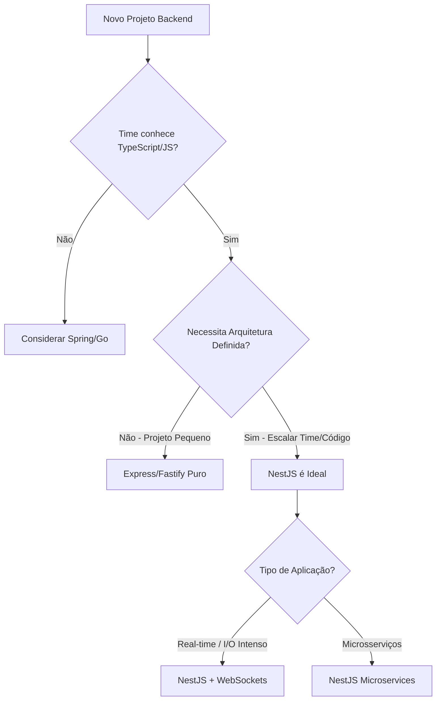

# NestJS: Elevando o Nível do Node.js

O **NestJS** surgiu para resolver um problema comum no mundo Node.js: a falta de arquitetura padronizada. Inspirado fortemente no Angular, ele traz organização, injeção de dependência e padrões de design sólidos para o backend JavaScript/TypeScript.

## 📊 Infográfico de Decisão

## 🏆 Principais Vantagens

1.  **Arquitetura Modular**: Organiza o código em Módulos, Controladores e Serviços. Isso facilita a navegação e manutenção.
2.  **TypeScript First**: Construído com e para TypeScript, oferecendo uma experiência de desenvolvimento superior com tipagem forte.
3.  **Flexibilidade de Plataforma**: Pode rodar sobre o Express (padrão) ou Fastify (para performance extrema).
4.  **Ecossistema Rico**: Integrações fáceis com TypeORM, Prisma, Mongoose, GraphQL, WebSockets e Microservices.

## ⚠️ Desvantagens

*   **Single-Threaded**: Como todo Node.js, pode sofrer com tarefas intensivas de CPU (bloqueio do Event Loop).
*   **Complexidade**: Para desenvolvedores acostumados com a simplicidade do Express puro, o NestJS pode parecer "over-engineered" (complexo demais).
*   **Debugging**: O uso intenso de Decorators pode tornar o fluxo de execução um pouco opaco às vezes.

## 🚀 Escalabilidade e Performance

*   **I/O Intenso**: O NestJS herda o modelo non-blocking I/O do Node.js, sendo imbatível para aplicações que lidam com muitas conexões simultâneas (chats, streaming, APIs de alta concorrência).
*   **Microsserviços**: Possui suporte nativo e leve para microsserviços, comunicando-se via TCP, Redis, Kafka, gRPC e RabbitMQ com facilidade.

## 🛡️ Segurança

O NestJS fornece ferramentas robustas para segurança:
*   **Guards**: Para autorização baseada em roles ou claims.
*   **Interceptors**: Para sanitização de dados.
*   Integração fácil com **Passport.js** para estratégias de autenticação (JWT, Google, Facebook).
*   Módulo `Throttler` para proteção contra Rate Limiting/DDoS.

## ⚡ Produtividade

A CLI do NestJS (`nest g resource users`) é uma das melhores do mercado. Ela gera todo o esqueleto de um CRUD (Controller, Service, DTOs, Entidades) em segundos.
Para times que já usam Angular no frontend, a curva de aprendizado é quase zero, permitindo que desenvolvedores transitem entre back e front (Fullstack) com facilidade.

## 🎯 Quando Usar?

*   **Startups e Scale-ups**: Que precisam de velocidade de desenvolvimento sem sacrificar a organização.
*   **Aplicações Real-time**: Chats, notificações, jogos multiplayer (via WebSockets/Socket.io).
*   **BFF (Backend for Frontend)**: Uma camada de API agregadora para servir frontends React/Angular/Mobile.
*   **Equipes Fullstack TypeScript**: Unificar a linguagem em todo o stack.

## 🏗️ Sustentação

O NestJS força boas práticas. A injeção de dependência torna o código testável (Unit e E2E). Isso significa que, à medida que o projeto cresce, ele não vira um "espaguete" de código, garantindo uma vida útil longa e saudável para a aplicação.

## 📚 Referências Oficiais

- [NestJS Documentation](https://docs.nestjs.com/) - Documentação oficial completa do NestJS
- [NestJS Fundamentals](https://docs.nestjs.com/first-steps) - Guia de primeiros passos oficial
- [NestJS Techniques](https://docs.nestjs.com/techniques/database) - Técnicas avançadas e integrações
- [NestJS Microservices](https://docs.nestjs.com/microservices/basics) - Guia oficial de microsserviços
- [NestJS GraphQL](https://docs.nestjs.com/graphql/quick-start) - Integração oficial com GraphQL
- [NestJS CLI](https://docs.nestjs.com/cli/overview) - Documentação da CLI do NestJS
- [Awesome NestJS](https://github.com/nestjs/awesome-nestjs) - Lista curada de recursos do NestJS
